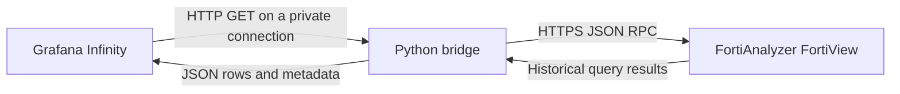

# FortiAnalyzer Grafana Bridge

A small Python service that makes historical FortiView web-usage data available to Grafana through ordinary JSON requests.

FortiView queries require authentication, asynchronous task polling, and result retrieval. This bridge handles those steps and exposes endpoints that work with the Grafana Infinity data source. It queries FortiAnalyzer on demand; no separate historical database or Prometheus ingestion is required.

**Community project. Not an official Fortinet or Grafana integration.** The initial scope is historical website usage, endpoint discovery, and native time series.



## What it provides

- FortiGate inventory and source-endpoint discovery.
- Website domains, session counts, transferred bytes, and blocked-session counts.
- Native FortiView time buckets for historical charts.
- Filters for one FortiGate, source IP, exact domain, and time range.
- Server-side FAZ sessions, one retry after session expiry, pagination, bounded results, and short-lived caching.
- A standard-library-only Python service, a Linux systemd unit, tests, and an optional Grafana dashboard.

## Start here

Read the **[integration guide](docs/INTEGRATION.md)** for deployment, network placement, authentication, the bridge API, and Infinity query configuration. It assumes you already know Grafana.

For a quick foreground test, use Python 3.10 or later:

```bash
git clone https://github.com/forticrevs/fortianalyzer-grafana-bridge.git
cd fortianalyzer-grafana-bridge
cp config.example.json config.json
# Edit config.json with your FAZ address, API account, and ADOM.
# Supply FAZ_PASSWORD through your environment or secret manager.
python3 adapter.py --config config.json
```

The default listener is `127.0.0.1:8788`. Keep TLS verification enabled for FAZ; use `ca_file` for a private CA. If Grafana runs in a separate container or host, follow the guide's networking and bridge-token instructions.

Check both service availability and FAZ access:

```bash
curl --fail-with-body http://127.0.0.1:8788/health
curl --fail-with-body http://127.0.0.1:8788/api/devices
```

Then test a historical data query as described in the guide. A healthy process alone does not prove FortiView access.

## Endpoints

| Endpoint | Returns |
| --- | --- |
| `/health` | Bridge availability |
| `/api/devices` | FortiGate inventory for the configured ADOM |
| `/api/sources` | Endpoint discovery from `source-website` |
| `/api/websites` | Domain results from `website-domain` |
| `/api/timeseries` | Native time buckets from `website-line` |
| `/api/summary` | Totals calculated from domain results |

Historical endpoints require `from` and `to` as Unix **milliseconds**. Optional filters are `device`, `source`, and `domain`. Responses contain `rows`; historical responses also contain `meta`. The bridge supports one configured ADOM per instance.

## Optional dashboard

[examples/dashboard.json](examples/dashboard.json) is an importable starting point. Choose your Infinity data source at import. It contains no credentials or saved query results. Build your own panels from the same endpoints if you prefer.

The dashboard generator is [examples/build_dashboard.py](examples/build_dashboard.py). Run `python3 examples/build_dashboard.py` to regenerate the JSON.

## Compatibility and limits

- **Python:** requires 3.10 or newer. See the repository's automated test results for the versions exercised in CI.
- **Grafana:** requires Infinity with the backend JSONata parser and Unix-millisecond field support. The example dashboard must be imported against your own data source.
- **FortiAnalyzer:** uses the `/jsonrpc` session API and FortiView `apiver: 3`. No release-by-release compatibility guarantee is claimed. Validate permissions, view availability, and response shapes on your target release. The local test suite uses synthetic data and does not certify FAZ firmware compatibility.
- **Load:** historical jobs are serialized, identical queries are cached for 60 seconds, and queries are limited to 31 days and 10,000 rows by default. Narrow the scope before increasing limits or refresh frequency.
- **Identity and units:** source IPs are not permanent device identities. Session counts are not page views. Traffic fields are bytes per bucket, not bandwidth rates. Multiple FortiGates may observe the same traffic.
- **View semantics:** source-view totals may differ from website totals. Use source results for navigation and domain/line results for website metrics.

This is a small integration service, not an Internet-facing or multi-tenant API. All callers share the configured FAZ account's access. Keep it private, control Grafana data-source access, and use an authenticated TLS reverse proxy when crossing hosts. See [SECURITY.md](SECURITY.md).

## Development

```bash
python3 -m unittest discover -v
```

Tests cover filtering, timestamp/metric conversion, pagination, cache reuse, task cleanup, session renewal, HTTP authentication, and response/error contracts without contacting an appliance.

Contributions are welcome. Include tests for changed behavior and use only synthetic or fully anonymized fixtures. Never include real logs, passwords, session IDs, hostnames, device serials, or screenshots containing operational data in issues or pull requests.

## License

[MIT](LICENSE).
